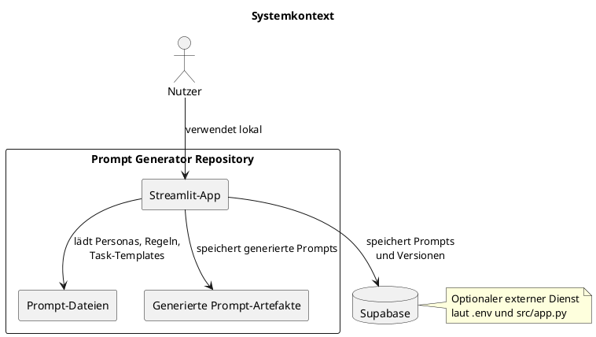
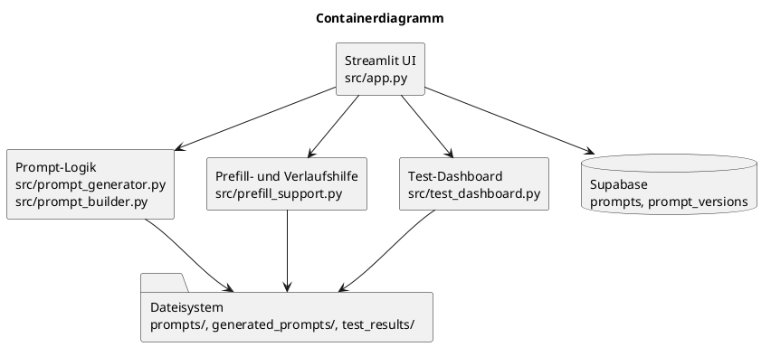

# Architektur

## Überblick

Das Repository enthält eine relativ kompakte Python-Architektur mit drei Hauptbereichen:

1. **Prompt-Bausteine als Dateien**
2. **Anwendungslogik zum Zusammenbau und Bewerten**
3. **Streamlit-Oberfläche mit optionaler Datenbankanbindung**

## Struktur des Repositories

```text
prompts/
  system/
  shared/
  tasks/
src/
  app.py
  prompt_builder.py
  prompt_generator.py
  prefill_support.py
  scenario_manager.py
  test_dashboard.py
tests/
docs/
generated_prompts/
test_results/
```

## Zentrale Module

| Modul | Aufgabe |
| --- | --- |
| `src/prompt_builder.py` | Laden von Markdown-Dateien und Basis-Pfaden |
| `src/prompt_generator.py` | Kernlogik für Prompt-Aufbau, Zieltypen und Qualitätsbewertung |
| `src/app.py` | Streamlit-Oberfläche und Supabase-bezogene Workflows |
| `src/prefill_support.py` | Vorlagen und Historienauswertung früherer Prompt-Dateien |
| `src/test_dashboard.py` | Darstellung und optionales Ausführen lokaler Tests |
| `src/scenario_manager.py` | dateibasierte Szenario-Versionierung |
| `src/llm_workflow_example.py` | Beispielhafter Workflow außerhalb der UI |

## Systemkontext



## Containerdiagramm



## Beobachtungen zur Architektur

- Die Anwendung ist bewusst kompakt gehalten.
- Die Geschäftslogik liegt direkt in Python-Modulen und nicht in einem separaten API-Server.
- Die Supabase-Anbindung erfolgt direkt aus der Streamlit-App.
- `app.py` im Projektroot existiert zusätzlich als einfachere Variante und kann zu Verwirrung führen.

## Offene Punkte

- TODO: fachlich klären, ob `src/app.py` dauerhaft der einzige Einstiegspunkt sein soll
- TODO: fachlich klären, ob `scenario_manager.py` künftig in die UI integriert werden soll
