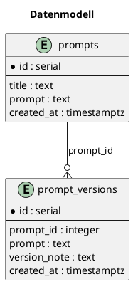

# Datenmodell

## Überblick

Das Repository enthält sowohl ein kleines relationales Datenmodell für gespeicherte Prompts als auch mehrere Python-Dataclasses für die In-Memory-Verarbeitung.

## Relationales Datenmodell

Aus `src/app.py` und `docs/CHECKPOINT_PROJEKT_STATUS.md` ist folgendes Schema ersichtlich.

### Tabelle `prompts`

| Feld | Typ | Bedeutung |
| --- | --- | --- |
| `id` | `serial` | Primärschlüssel |
| `title` | `text` | Titel des gespeicherten Prompts |
| `prompt` | `text` | Prompt-Inhalt |
| `created_at` | `timestamptz` | Erstellzeitpunkt |

### Tabelle `prompt_versions`

| Feld | Typ | Bedeutung |
| --- | --- | --- |
| `id` | `serial` | Primärschlüssel |
| `prompt_id` | `integer` | Fremdschlüssel auf `prompts.id` |
| `prompt` | `text` | Versionierter Prompt-Text |
| `version_note` | `text` | Freitext zur Version |
| `created_at` | `timestamptz` | Erstellzeitpunkt |

## Beziehung

## Python-Dataclasses

Aus `src/prompt_generator.py`:

- `PromptRequest`
- `QualityCheckResult`
- `DeterministicQualityResult`

Aus `src/scenario_manager.py`:

- `ScenarioVersion`
- `Scenario`

## Dateibasierte Artefakte

Zusätzlich werden Daten auch dateibasiert abgelegt:

- generierte Prompts unter `generated_prompts/`
- Testartefakte unter `test_results/`
- potenzielle Szenario-Dateien unter `scenarios/`

## Hinweise

Das Repository enthält keinen allgemeinen ORM-Layer oder ein Migrationsframework. Die Tabellenerstellung erfolgt aktuell direkt per SQL-String in `src/app.py`.
